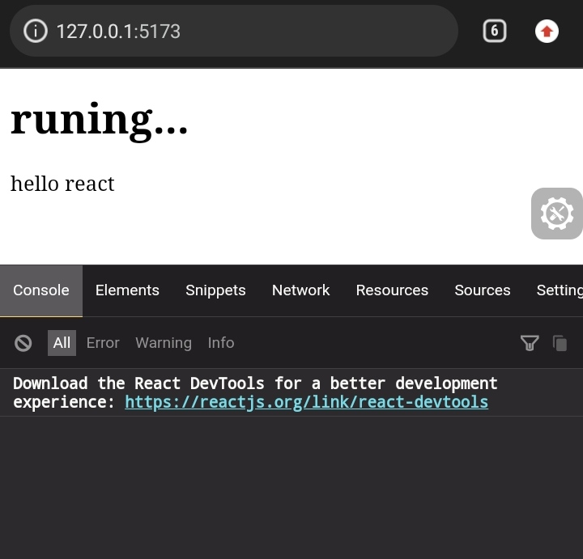

# **desc**
this a simpl react app with [**vite**](https://vitejs.dev/) that you can run it in your mobile and start learning react or create a simple react projects

inclued **[eruda](https://eruda.liriliri.io/) mobile console**

# **requirments** 
to use react in your mobile all you need is:

- `terminal`:  _i recomended_ [**termux**](https://play.google.com/store/apps/details?id=com.termux).

- `editor`: you can use any editor you like, _i recomended_ [**spck editor**](https://play.google.com/store/apps/details?id=io.spck).

# **how to run**

first open your terminal 'termux' then follow this command:
1. `pkg update -y && pkg upgarde -y`.
2. `pkg install nodejs`
3. `pkg install git`
4. `npm i -g vite`

than clone this repo.

`git clone <repo_link>`

after clone folders, open root directory and run this flowing command:

1. `npm run setup`: to install all dependencies/devDependencies.
2. `npm run dev`: to serv app, or just write `vite` and pass enter.

:rocket: Congratulations you are now ready.

# **to add packegs**

- `npm run add <packeg_name` => to add dependencies, for example `npm run add axios`.
- `npm run addD <packeg_name` => to add devDependencies
- `npm run build` => to build
- `npm run preview` => to preview